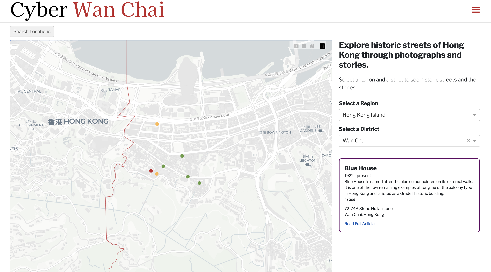
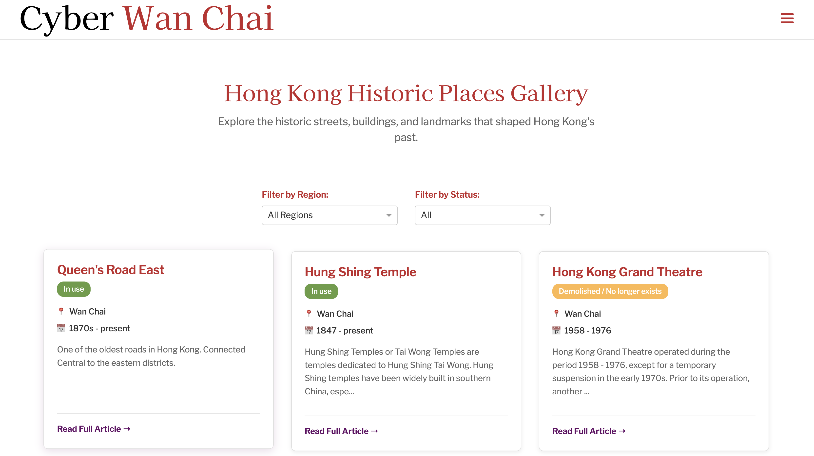

# Cyber Wan Chai 

*Wu Yee Sun College Final Year Project*


**OUR WEBSITE: cyberwanchai.org** 

## Overview
Cyber Wan Chai is an interactive web application that showcases historical photographs and stories of Hong Kong's iconic streets and locations. Built as a dynamic user interface, it allows users to explore the rich history and culture of Hong Kong through curated photo collections and location-based storytelling.

### Features
- **Interactive Map**: Explore Hong Kong locations with historical significance
- **Photo Galleries**: View curated collections of historical photographs
- **Location Stories**: Read detailed articles about Hong Kong's streets and landmarks
- **Region Navigation**: Browse by districts and specific areas
- **Responsive Design**: Optimized for desktop and mobile viewing

----

## Explore Page




The Explore Page allows users to discover Hong Kong's historical locations through an interactive map interface. Users can navigate between different districts and areas to explore curated collections of historical photographs and stories.


----

## Gallary Page



The Gallary Page provides users with deeper insights into Hong Kong's historical narrative through curated content and visual storytelling. Users can explore trends, browse by different categories, and discover connections between locations and their historical significance.


----


## Motivation

This project stems from a passion for preserving and sharing Hong Kong's rich cultural heritage through the lens of historical photography and digital storytelling. As someone fascinated by urban history and the transformation of cities over time, I wanted to create an accessible platform that showcases Hong Kong's architectural legacy and cultural evolution.

The application serves as both a historical archive and an educational resource, making Hong Kong's history more accessible to both locals and visitors interested in understanding the city's development through visual storytelling.

#### Project Evolution

The application has evolved from a basic mapping interface to a comprehensive historical exploration platform, incorporating user-friendly design principles and rich multimedia content presentation.

----

## Future Development

The development of this project will continue to expand the historical archive and enhance the user experience for exploring Hong Kong's heritage. We plan to continuously add new locations, photographs, and historical content while improving the platform's functionality.

----

## Local Setup Guide

Follow these instructions to run the Hong Kong Historical Photo Gallery application locally on your machine.

### Step 1: Clone the Repository

Start by cloning the project from the GitHub repository:

```bash
git clone <repository-url>
cd cyber_wc
```

### Step 2: Set Up the Project with uv

This project uses [`uv`](https://github.com/astral-sh/uv) for fast and reliable dependency management. If you don't have `uv` installed, you can install it from the official documentation.

```bash
# Install dependencies using uv (recommended)
uv sync
```

### Step 4: Set Up Environment Variables

For enhanced features like AI-powered content suggestions, create a `.env` file in the root directory:

```bash
# Create .env file
touch .env
```

Add following to the .env file:
```bash
FLASK_ENV=development
```

### Step 4: Run the Application

```bash
# Using uv (recommended)
uv run cyber_wc_app.py

# Alternative: Activate virtual environment and run
# uv creates a virtual environment automatically, but you can also run:
source .venv/bin/activate  # On macOS/Linux
# OR on Windows: .venv\Scripts\activate
python cyber_wc_app.py
```

The application will be available at `http://127.0.0.1:8050` or `http://localhost:8050`.

### Development Mode

For local development with hot-reloading:

1. The app runs in development mode by default when using `uv run`
2. Any changes to Python files will automatically restart the server
3. Debug mode is enabled for better error reporting

---

## Contributions

Contributions are welcome! If you'd like to contribute or discuss potential features, feel free to reach out via a GitHub issue or by submitting a pull request.

For major changes, please open an issue first to discuss what you would like to contribute.

If you are not familar with the git workflow, you can send your ideas/photos/articles to me at cyberwc@dweng.org

Thank you for your interest in Hong Kong history and the Cyber Wan Chai project!

----

### Attributions

- **Historical Photography**: Images and content are curated from various public archives and private collections documenting Hong Kong's architectural and cultural heritage
- **Geographic Data**: Hong Kong district boundaries and location data sourced from public geographic information systems

----

[](LICENSE.md) 

----
